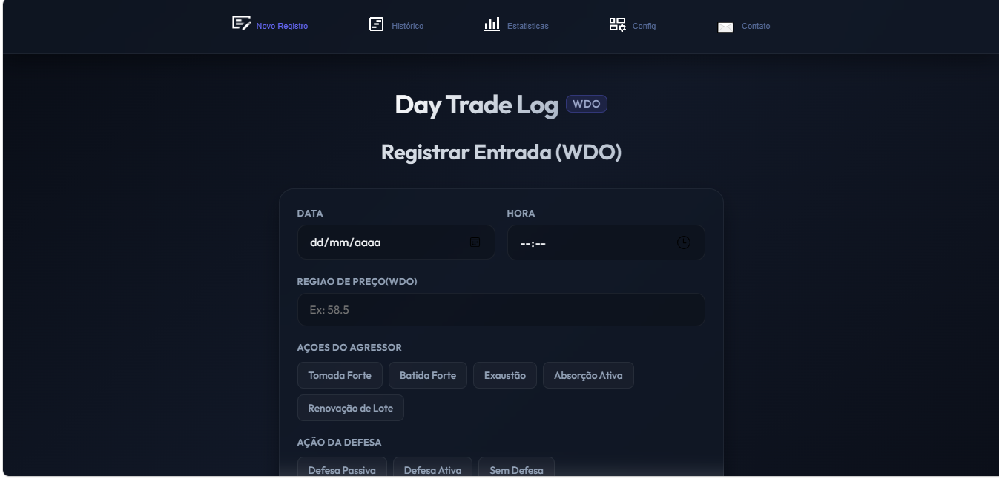
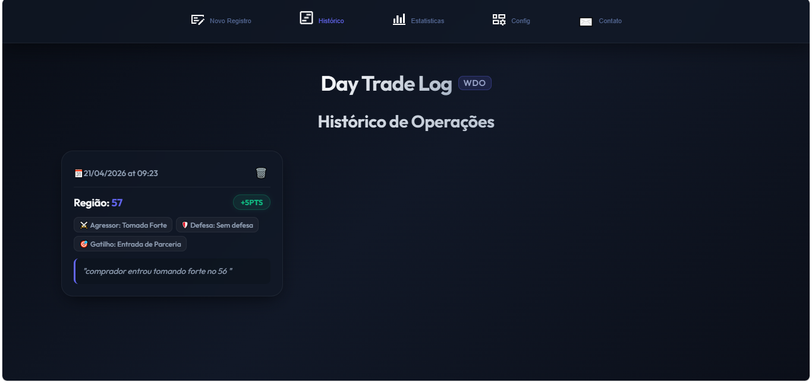
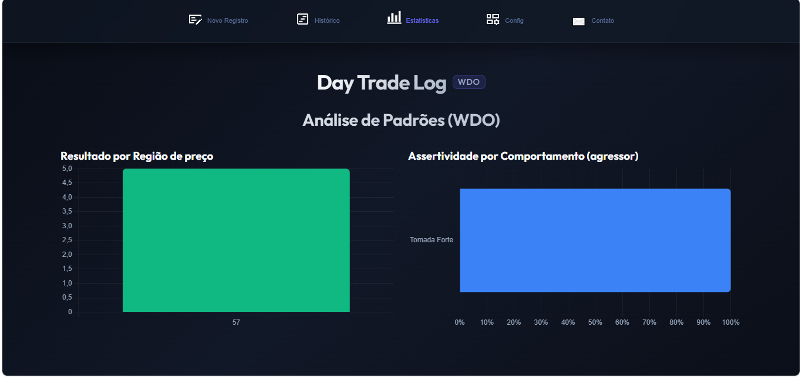
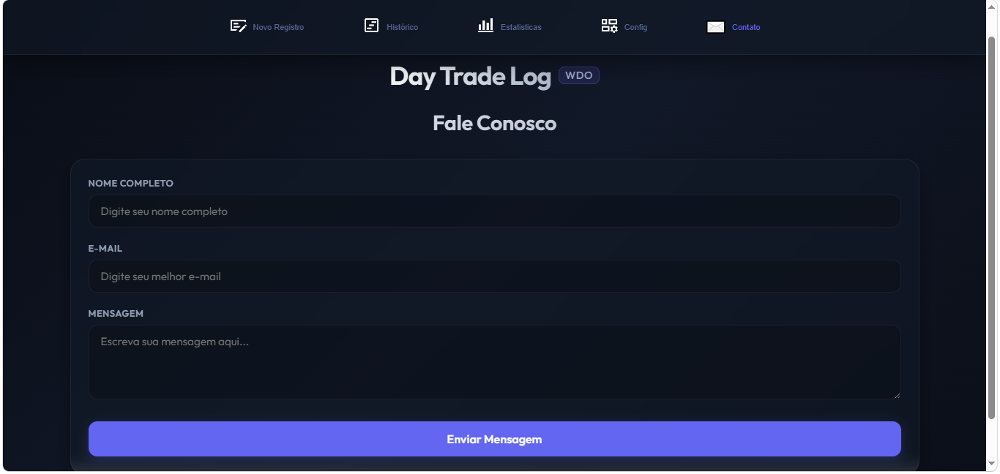

# Relatório Técnico: Webapp de Log e Análise para Day Trade (WDO)

Este projeto consiste em um aplicativo web responsivo e moderno projetado para registrar e analisar a performance de operações de Day Trade na modalidade de **Tape Reading (Leitura de Fluxo)** no mercado de Mini-Dólar (WDO) baseado em replays de mercado.

A aplicação foi desenvolvida em conformidade com as diretrizes e requisitos da disciplina, priorizando a modularização, usabilidade e persistência segura no lado do cliente.

---

## 💻 1. Tecnologias Utilizadas

Para atender aos requisitos de desempenho e compatibilidade, foram utilizadas tecnologias nativas do ecossistema Web, sem a necessidade de empacotadores ou frameworks pesados no frontend:

1. **HTML5 Semântico:** Estrutura organizada para motores de busca (SEO) e acessibilidade (leitores de tela), utilizando tags apropriadas como `<main>`, `<nav>`, `<header>`, `<section>` e atributos de acessibilidade.
2. **CSS3 Moderno (Glassmorphism & Flexbox/Grid):** A identidade visual baseia-se em uma paleta dark premium inspirada em plataformas de trading. O design utiliza efeitos de transparência (*glassmorphism* com `backdrop-filter`) e layouts responsivos suportando dispositivos móveis e desktops via *Media Queries*.
3. **JavaScript Moderno (ES6+):** Programação assíncrona, orientada a eventos e estruturada por meio de **Módulos Nativos** (`type="module"`), que evitam o vazamento de escopo global.
4. **Chart.js:** Biblioteca externa carregada de forma otimizada no HTML para a geração de gráficos de barras verticais e horizontais que mostram estatísticas de saldo acumulado e assertividade.
5. **Web Storage API (LocalStorage):** Persistência de dados segura gravada localmente no disco (SSD) do usuário, garantindo que os dados não sejam perdidos ao fechar ou atualizar o navegador.
6. **FileReader & Blob APIs:** Utilizadas para ler arquivos de texto enviados pelo usuário e gerar links temporários para o download de backups no formato JSON.
7. **Google Fonts & Material Symbols:** Fonte moderna (*Outfit*) utilizada para tipografia premium e ícones estéticos vetoriais adotados no menu de abas.

---

## 🏛️ 2. Arquitetura do Site e Divisão Modular

O projeto foi totalmente desacoplado para respeitar o princípio da responsabilidade única. A estrutura de diretórios do sistema é organizada da seguinte forma:

```text
├── index.html            # Estrutura principal e esqueleto do dashboard
├── README.md             # Este relatório técnico de documentação
├── .gitignore            # Regras para ignorar arquivos locais
├── src/
│   ├── index.js          # Ponto de entrada do app (inicialização e eventos do form)
│   ├── helpers.js        # Módulo responsável pela leitura e escrita no LocalStorage
│   ├── renderHistory.js  # Módulo focado na renderização dinâmica dos cartões de log
│   ├── charts.js         # Módulo focado na lógica de agrupamento e plotagem com o Chart.js
│   ├── import-export.js  # Módulo de manipulação de download e leitura de backups JSON
│   ├── contact.js        # Módulo para validação regex e reativa do formulário de contato
│   └── public/
│       ├── style.css     # Estilos globais, design system e regras de responsividade
│       └── assets/       # Ícones, imagens e capturas de tela do aplicativo
```

---

## 📊 3. Conceitos da Disciplina Aplicados

* **Manipulação e Travessia do DOM:** O JavaScript monitora cliques e submissões, gerando e inserindo elementos HTML dinamicamente (como a lista reversa de operações na tela de histórico).
* **Delegação de Eventos:** Para a exclusão de operações, aplicamos um único escutador de eventos no contêiner pai (`log-list`) que delega a ação ao botão de exclusão de cada cartão específico (`.delete-btn`), otimizando o uso de memória.
* **Expressões Regulares (Regex):** O formulário de contato realiza uma validação minuciosa com a regex `/^[^\s@]+@[^\s@]+\.[^\s@]+$/` para garantir o formato correto de e-mail.
* **Acessibilidade (A11y):** Implementação de descrições textuais (`alt`) nas imagens e rótulos acessíveis (`aria-label`) nos botões de navegação e formulários para suporte a tecnologias assistivas.
* **SEO e Metadados:** Estrutura contendo meta tags Open Graph (facilitando compartilhamento em aplicativos de mensagens) e cabeçalho `<h1>` único de marca no topo do documento.

---

## ⚔️ 4. Desafios Enfrentados e Soluções

1. **Dependências Circulares em Módulos ES6:**
   * *Desafio:* No início da modularização, o arquivo de renderização e o ponto de entrada importavam variáveis um do outro, o que fazia com que alguns seletores de elementos do DOM carregassem como `undefined`.
   * *Solução:* Eliminamos os acoplamentos fazendo com que cada script isole a busca dos seus respectivos elementos HTML usando `document.getElementById` localmente.
2. **Limpeza de Memória com Chart.js:**
   * *Desafio:* Ao atualizar ou excluir registros, os novos gráficos eram redesenhados em cima dos antigos no mesmo canvas, causando tremulação visual ao passar o mouse.
   * *Solução:* Guardamos a referência da instância do gráfico em variáveis globais no módulo e executamos o método `.destroy()` da biblioteca antes de renderizar qualquer gráfico novo.
3. **Segurança do Navegador (CORS local):**
   * *Desafio:* O navegador bloqueia o carregamento de arquivos locais com o protocolo `file://` ao usar imports ES6.
   * *Solução:* Foi necessária a implementação de servidores de desenvolvimento local HTTP (como a extensão Live Server do VS Code) para que a aplicação pudesse rodar localmente de forma simulada.

---

## 📸 5. Capturas de Tela do Resultado Final

Abaixo estão as capturas de tela demonstrando a interface funcional do sistema em diferentes contextos operacionais:

### 1. Tela de Registro de Operações

*Interface de registro de trade e observações do replay de mercado.*

### 2. Histórico de Trades Cadastrados

*Histórico de cartões de operações em formato de cards detalhados.*

### 3. Painel de Análise Estatística (Gráficos)

*Análise de performance com gráficos de barras verticais (pontos acumulados por região de preço) e horizontais (assertividade por agressão).*

### 4. Área de Configurações e Backup

*Ferramentas de backup locais para download e upload das operações via arquivo JSON.*

### 5. Formulário de Contato

*Interface da aba Fale Conosco para suporte e envio de feedbacks.*

### 6. Sistema de Validação de Erros Reativa

*Feedback visual em tempo de digitação (UX premium) para formulários inconsistentes.*
